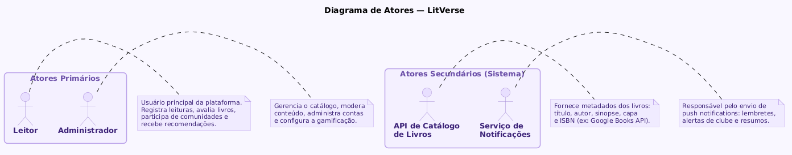
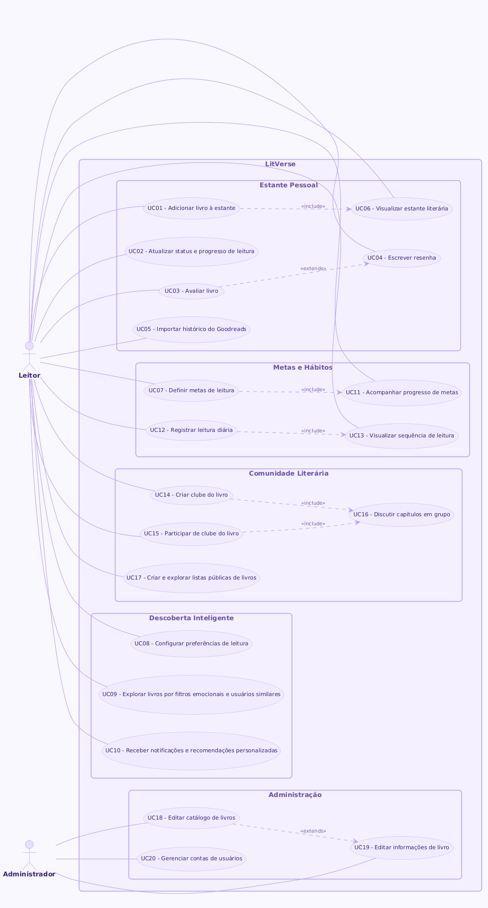
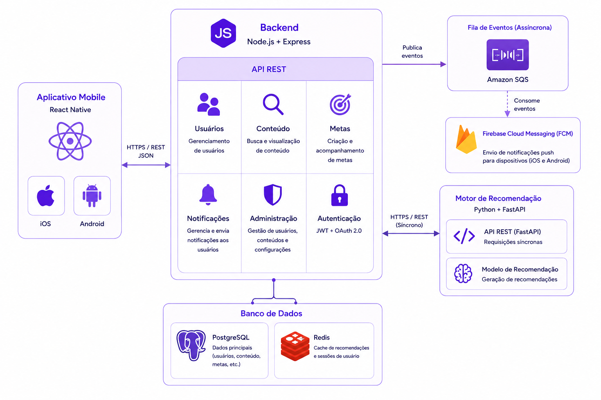

<div align="center">
  
</div>

# 📖 LitVerse 

> [!NOTE]
> **Toda leitura deixa uma marca. O LitVerse ajuda você a encontrar a próxima.** <br>
> Uma plataforma inteligente que conecta leitores a novas histórias por meio de recomendações personalizadas, comunidades literárias e uma experiência criada para transformar a descoberta de livros em algo tão emocionante quanto a própria leitura.

<table>
  <tr>
    <td width="800px">
      <div align="justify">
        O <b>Litverse</b> nasceu da vontade de tornar a descoberta de livros tão envolvente quanto a própria leitura. Em vez de recorrer a diferentes plataformas para registrar leituras, buscar recomendações, acompanhar metas e interagir com outros leitores, o LitVerse centraliza toda a jornada literária em uma única experiência inteligente e personalizada. 
        <br> A plataforma utiliza um sistema de recomendação que aprende com os hábitos, avaliações e preferências de cada usuário para sugerir histórias realmente relevantes, enquanto promove a interação por meio de resenhas, desafios, comunidades e metas de leitura. 
        <br> O projeto une tecnologia, análise de dados e design centrado no usuário para criar um ecossistema que não apenas organiza a vida literária dos leitores, mas também os conecta a novas histórias, novas pessoas e novas experiências.
      </div>
    </td>
    <td>
      <div align="center">
        
      </div>
    </td>
  </tr>
</table>

---
## 🚧 Status do Projeto

[](https://github.com/seu-usuario/lifeduo/releases)


[](#-licença)


---

## 📚 Índice
- [Sobre o Projeto](#-sobre-o-projeto)
- [Funcionalidades Principais](#-funcionalidades-principais)
- [Tecnologias Utilizadas](#-tecnologias-utilizadas)
- [Arquitetura](#-arquitetura)
  - [Diagramas](#diagramas)
- [Instalação e Execução](#-instalação-e-execução)
- [Estrutura de Pastas](#-estrutura-de-pastas)
- [Documentações utilizadas](#-documentações-utilizadas)
- [Autor](#-autor)
- [Agradecimentos](#-agradecimentos)
- [Licença](#-licença)

---

## 📝 Sobre o Projeto

O LitVerse nasceu de uma frustração real: encontrar o próximo livro certo ainda depende de sorte, algoritmos genéricos ou posts aleatórios em redes sociais. A plataforma existe para mudar isso — colocando tecnologia, comunidade e personalização a serviço de quem leva a leitura a sério.

**O problema que queremos resolver:** Leitores hoje vivem fragmentados entre apps de estante, grupos de WhatsApp, listas no Notion e recomendações que ignoram seu histórico real. Não existe um lugar que una registro, descoberta, metas e comunidade de forma inteligente — o LitVerse preenche exatamente esse espaço.

**O que nos diferencia:** Não somos mais um catálogo. O coração do LitVerse é um sistema de recomendação que aprende com cada avaliação, cada livro abandonado e cada maratona de leitura — e entrega sugestões que fazem sentido para aquele leitor específico. Somado a isso, desafios literários, comunidades temáticas e metas personalizadas tornam a experiência contínua e envolvente.

**Origem acadêmica, visão de produto:** Desenvolvido na disciplina de Projeto de Software da Engenharia de Software — PUC Minas, o LitVerse foi concebido desde o início com arquitetura e escopo compatíveis com evolução para um produto comercial real.

**Para quem é:** Disponível via web e app mobile (iOS e Android), a plataforma atende leitores em qualquer ritmo — de quem termina um livro por mês a quem já está pensando no próximo antes de fechar o atual.

---

## ✨ Funcionalidades Principais

### 📚 Estante Pessoal

- **Organização por status:** Lendo, lido, quero ler, abandonado — com data de início e conclusão registradas automaticamente.
- **Progresso de leitura:** Atualização manual ou por páginas, com visualização de ritmo ao longo do tempo.
- **Avaliações e resenhas:** Nota, texto livre e tags de humor de leitura (relido, presente, indicado por alguém).
- **Importação de histórico:** Suporte a exportação do Goodreads para migração sem atrito.

### 🔍 Descoberta Inteligente

- **Feed personalizado:** Sugestões que aprendem com avaliações, gêneros favoritos e padrões de leitura reais.
- **Recomendações por contexto:** "Para ler num fim de semana", "Parecido com o último que você amou", "Curto e intenso".
- **Exploração por mood:** Filtros emocionais além de gênero — tenso, reconfortante, filosófico, leve.
- **Descoberta via comunidade:** O que pessoas com gosto parecido ao seu estão lendo agora.

### 🎯 Metas de Leitura

- **Desafio anual:** Meta de livros por ano com acompanhamento visual de progresso.
- **Metas personalizadas:** Por gênero, idioma, autor novo ou país de origem — vai além do número.
- **Streak de leitura:** Sequência de dias com registro de progresso, com proteção por freeze para imprevistos.
- **Celebração de marcos:** Notificações e conquistas ao atingir metas parciais e finais.

### 💬 Comunidade Literária

- **Clubes do livro:** Criação de grupos de leitura com timeline compartilhada e discussões por capítulo.
- **Listas públicas:** Curadoria aberta — "Melhores distopias", "Leituras para o metrô", criadas por qualquer usuário.


### 🔔 Notificações e Lembretes

- **Lembrete de leitura diária:** Horário configurável para manter o hábito.
- **Alertas de clube:** Aviso quando uma discussão nova é aberta ou o prazo de leitura se aproxima.
- **Novidades de autores favoritos:** Notificação automática quando um autor da sua estante lança algo novo.
- **Resumo semanal:** Recapitulação de progresso, páginas lidas e sugestão da semana.

---

## 🛠 Tecnologias Utilizadas

### 📱 Mobile

| Tecnologia | Versão | Finalidade |
|---|---|---|
| **React Native** | 0.81 | Framework principal do app mobile |
| **Expo** | 54 | Toolchain sobre React Native; build, preview e acesso a APIs nativas simplificado. |
| **TypeScript** | 5.x | Tipagem estática do código.|
| **Zustand** | 4.x | Gerenciamento de estado global (sessão, preferências, cache local) |
| **Expo Notifications** | — | Push notifications locais e remotas |
| **React Navigation** | — | Navegação entre telas (stack, tabs, drawer) com gestos nativos. |
| **NativeWind** | 4.x | Tailwind CSS adaptado para React Native; estilização consistente com a web |


### 🖥️ Back-end

| Tecnologia | Versão | Finalidade |
|---|---|---|
| **Node.JS** | 20 LTS | Runtime do servidor principal; alta concorrência para requisições da plataforma
| **Fast API** | 0.115.x | Microsserviço Python para o motor de recomendação; integração nativa com libs de ML
| **Apollo Client** | - | Consumo da API GraphQL; cache local de queries e sincronização de dados para descoberta de livros com filtros dinâmicos |
| **NestJS** | 10.x | Framework backend modular |
| **TypeScript** | 5.x | Tipagem estática |
| **PostgreSQL** | 16 | Banco de dados relacional principal |
| **Redis** | 7.x | Cache de recomendações pré-calculadas, sessões, filas e rate limiting |
| **JWT + Passport** | — | Autenticação e autorização |
| **Firebase Cloud Messaging** | — | Push notifications remotas |
| **Amazon SQS** | — | Filas de processamento assíncrono (missões, notificações) |

### ⚙️ Infraestrutura & DevOps

| Tecnologia | Finalidade |
|---|---|
| **Docker + Docker Compose** | Containerização do ambiente local |
| **EAS Build** | Build e distribuição do app nas lojas |
| **Expo Auth Session** | Fluxo OAuth 2.0 nativo para login com Google e Apple no mobile
| **Expo Camera** | Leitura de ISBN por câmera para adicionar livros à biblioteca pessoa
| **Jest + Testing Library** | Testes unitários e de componentes React Native
| **SonarQube** | Análise de qualidade de código |

---

## 🏗 Arquitetura


**Decisões arquiteturais principais:**
- **Monólito modular**: Ponto de partida escolhido pela menor complexidade operacional. Os módulos internos são bem delimitados, facilitando uma futura migração para microsserviços caso necessário.
- **Motor de recomendação isolado**:  Único serviço extraído do monólito desde o início, justificado pelo seu perfil computacional intensivo e pela dependência natural do ecossistema Python.
- **Comunicação REST + assíncrona**: A comunicação entre o app e o backend ocorre de forma síncrona via REST. Entre o monólito e o motor de recomendação, a comunicação é assíncrona via SQS.
- **Cache com Redis**: Recomendações pré-calculadas e sessões de usuário são armazenadas em cache, evitando acionamentos desnecessários do motor a cada requisição.
- **Autenticação JWT + OAuth 2.0**: Autenticação stateless, sem armazenamento de credenciais no servidor, com suporte a login social via Google e Apple.
- **PostgreSQL como banco principal**: Modelagem relacional cobrindo as entidades centrais do sistema: usuários, livros, avaliações, metas e comunidades.

**Infraestrutura (diagrama de implantação):**

- **React Native + Expo** — Base de código única para iOS e Android, com acesso simplificado a recursos nativos como câmera e notificações push.
- **Zustand** — Gerenciamento de estado leve no cliente, com cache local dos dados já carregados para reduzir requisições redundantes.
- **Node.js + Express** — Backend principal responsável por expor a API REST para os módulos core do sistema.
- **FastAPI (Python)** — Serviço de recomendação implementado como container independente, aproveitando o ecossistema científico do Python.
- **Firebase FCM + Expo Notifications** — FCM atua como transportador das notificações push; Expo Notifications funciona como camada de abstração no cliente.
- **Elastic Beanstalk** — Hospedagem do monólito Node.js com auto scaling e balanceamento de carga gerenciados pela AWS.
- **ECS Fargate** — Hospedagem do serviço de recomendação em container isolado, com alocação de recursos independente do monólito.
- **RDS (PostgreSQL)** — Banco de dados gerenciado com configuração Multi-AZ e réplicas de leitura para alta disponibilidade.
- **Amazon SQS** — Fila gerenciada para comunicação assíncrona entre o monólito e o motor de recomendação.

### Diagramas

Para melhor visualização e entendimento da estrutura do sistema, os diagramas principais estão organizados abaixo.

#### Diagrama de Atores


#### Diagrama de Casos de Uso


#### Diagrama de Arquitetura


> [!NOTE]
> Os diagramas acima foram gerados com **PlantUML**. Os arquivos-fonte `.puml` estão disponíveis em `/docs/puml/`.
> Para consulta de todos os diagramas do sistema, consulte em docs/LitVerse - Documentação de Projeto.docx

---

## 🔧 Instalação e Execução

---

## 📂 Estrutura de Pastas

```
LitVerse/
├── .git/                          # 🔗 Repositório Git local
├── .idea/                         # 💡 Configurações do IntelliJ IDEA
├── README.md                      # 📘 Documentação principal do projeto
├── LICENSE                        # ⚖️ Licença MIT
├── Logo_Litverse.png              # 🎨 Logo do projeto
│
└── docs/                          # 📚 Documentação técnica, diagramas e especificações
    │
    ├── 📄 Diagramas principais (nível de sistema)
    │   ├── Diagrama de Arquitetura.png                # 🏗️ Visão geral da arquitetura do sistema
    │   ├── Diagrama de Casos de Uso.png               # 🎯 Casos de uso do sistema
    │   ├── Diagrama de Componentes e Implantação.png  # 🔧 Componentes e implantação em infraestrutura
    │   ├── DiagramaAtores.png                         # 👥 Atores e tipos de usuários do sistema
    │   ├── diagramaAtores.puml                        # 📝 Fonte PlantUML do diagrama de atores
    │   └── casos-de-uso.puml                          # 📝 Fonte PlantUML dos casos de uso
    │
    ├── 📂 Diagrama de Classes/                        # 🗂️ Diagramas UML de classes por caso de uso
    │   ├── UC01_UC06 - DiagramadeClasses.puml         # Autenticação e Consultar Livro
    │   ├── UC02-DiagramaDeClasses.puml                # Gerenciar Estante
    │   ├── UC03_UC04 - DiagramaDeClasses.puml         # Escrever Resenha e Avaliações
    │   ├── UC05-DiagramadeClasses.puml                # Metas de Leitura
    │   ├── UC07_UC011 - DiagramadeClasses.puml        # Feed Personalizado
    │   ├── UC08-DiagramadeClasses.puml                # Desafios
    │   ├── UC09 - DiagramadeClasses.puml              # Gerenciar Comunidades
    │   ├── UC10 - DiagramadeClasses.puml              # Recomendações
    │   ├── UC12_UC13 - DiagramadeClasses.puml         # Streaks e Notificações
    │   ├── UC14_UC15_UC16 - DiagramadeClasses.puml    # Filtros e Exploração
    │   ├── UC17 - DiagramadeClasses.puml              # Importação de Histórico
    │   ├── UC18_UC19 - DiagramadeClasses.puml         # Gerenciar Listas Públicas
    │   ├── UC20 - DiagramadeClasses.puml              # Sincronização
    │   └── [Arquivos .png correspondentes]
    │
    ├── 📂 Diagrama de Estado/                         # 🔄 Diagramas de estado para UC críticos
    │   ├── DiagramadeEstadoUC1_UC2_UC6.puml           # Estados de autenticação, estante e consulta
    │   ├── DiagramadeEstadoUC5.puml                   # Estados de metas de leitura
    │   ├── DiagramadeEstadoUC7_UC11.puml              # Estados do feed e descoberta
    │   ├── DiagramadeEstadoUC12_UC13.puml             # Estados de notificações e streaks
    │   └── [Arquivos .png correspondentes]
    │
    ├── 📂 Diagramas de Sequencia/                     # 🔀 Diagramas de sequência (interações)
    │   ├── UC01-DiagramadeSequencia.puml              # Fluxo de autenticação
    │   ├── UC02-DiagramadeSequencia.puml              # Fluxo de estante
    │   ├── UC03-DiagramadeSequencia.puml              # Fluxo de resenha
    │   ├── UC04-DiagramadeSequencia.puml              # Fluxo de avaliações
    │   ├── UC05-DiagramadeSequencia.puml              # Fluxo de metas
    │   ├── UC06-DiagramadeSequencia.puml              # Fluxo de consulta de livro
    │   ├── UC07-DiagramadeSequencia.puml              # Fluxo do feed
    │   ├── UC08-DiagramadeSequencia.puml              # Fluxo de desafios
    │   ├── UC09-DiagramadeSequencia.puml              # Fluxo de comunidades
    │   ├── UC10-DiagramadeSequencia.puml              # Fluxo de recomendações
    │   ├── ... (UC11 a UC20)
    │   └── [Arquivos .png correspondentes]
    │
    ├── 📂 Diagrama de Comunicação/                    # 💬 Diagramas de comunicação (interações)
    │   ├── Diagrama de Comunicação P1.puml            # Comunicação entre componentes PT1
    │   ├── DiagramadeComunicacaoPT2.puml              # Comunicação entre componentes PT2
    │   ├── DiagramadeComunicacaoPT3.puml              # Comunicação entre componentes PT3
    │   ├── DiagramadeComunicacaoPT4.puml              # Comunicação entre componentes PT4
    │   └── [Arquivos .png correspondentes]
    │
    └── 📂 Modelo de Dados/                            # 💾 Diagramas de dados e banco de dados
        ├── ModeloDeDados.puml                         # Diagrama ER do banco de dados
        └── ModeloDeDados.png                          # Visualização do modelo de dados
```

### 📋 Descrição das Pastas

- **docs/** — Centraliza toda a documentação técnica do projeto, incluindo diagramas UML, especificações de design, modelos de dados e fluxos de interação gerados com PlantUML.

---

## 🔗 Documentações utilizadas

* 📖 **Mobile Framework:** [Documentação oficial do **React Native**](https://reactnative.dev/docs/getting-started)
* 📖 **Toolchain Mobile:** [Documentação do **Expo**](https://docs.expo.dev/)
* 📖 **Build & Deploy Mobile:** [Documentação do **EAS Build**](https://docs.expo.dev/build/introduction/)
* 📖 **Back-end Framework:** [Documentação oficial do **NestJS**](https://docs.nestjs.com/)
* 📖 **Filas assíncronas:** [Documentação do **BullMQ**](https://docs.bullmq.io/)
* 📖 **Push Notifications:** [**Firebase Cloud Messaging (FCM)**](https://firebase.google.com/docs/cloud-messaging)
* 📖 **Containerização:** [Documentação de Referência do **Docker**](https://docs.docker.com/)
* 📖 **Diagramas:** [**PlantUML Language Reference Guide**](https://plantuml.com/guide)
* 📖 **Padrão de Commits:** [**Conventional Commits**](https://www.conventionalcommits.org/en/v1.0.0/)
* 📖 **Autenticação:** [**JWT — RFC 7519**](https://datatracker.ietf.org/doc/html/rfc7519)

---

## 👥 Autor

| 👤 Nome | 🐈 GitHub | 💼 LinkedIn | 📤 Gmail |
|---------|-----------|-------------|-----------|
| Ana Luiza de Freitas | <div align="center"><a href="https://github.com/analufreitasx"></a></div> | <div align="center"><a href="https://www.linkedin.com/in/ana-luizadefreitas"></a></div> | <div align="center"><a href="mailto:analuizafreitas12@yahoo.com.br"></a></div> |

---

## 🙏 Agradecimentos

* [**Engenharia de Software PUC Minas**](https://www.instagram.com/engsoftwarepucminas/) — Pelo apoio institucional, estrutura acadêmica e fomento à inovação e boas práticas de engenharia.
* [**Prof. Dr. João Paulo Aramuni**](https://github.com/joaopauloaramuni) — Pelos valiosos ensinamentos sobre **Arquitetura de Software**, **Padrões de Projeto** e pelo template que norteou esta documentação.
* [**Fernanda Kipper**](https://www.instagram.com/kipper.dev/) — Pelos ensinamentos em **React Native** e melhores práticas de **Front-end mobile**.
---

## 📄 Licença

Este projeto é distribuído sob a **[Licença MIT](./LICENSE)**.

---

<div align="center">
  Feito por Ana Luiza de Freitas de Engenharia de Software — PUC Minas
</div>
