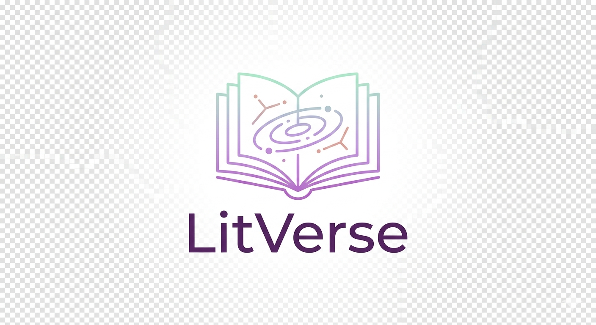

  

# 📖 LitVerse 

> [!NOTE]
> **Toda leitura deixa uma marca. O LitVerse ajuda você a encontrar a próxima.**  
> Uma plataforma inteligente que conecta leitores a novas histórias por meio de recomendações personalizadas, comunidades literárias e uma experiência criada para transformar a descoberta de livros em algo tão emocionante quanto a própria leitura.

<table>
  <tr>
    <td width="800px">
      

        O <b>Litverse</b> nasceu da vontade de tornar a descoberta de livros tão envolvente quanto a própria leitura. Em vez de recorrer a diferentes plataformas para registrar leituras, buscar recomendações, acompanhar metas e interagir com outros leitores, o LitVerse centraliza toda a jornada literária em uma única experiência inteligente e personalizada. 
          A plataforma utiliza um sistema de recomendação que aprende com os hábitos, avaliações e preferências de cada usuário para sugerir histórias realmente relevantes, enquanto promove a interação por meio de resenhas, desafios, comunidades e metas de leitura. 
          O projeto une tecnologia, análise de dados e design centrado no usuário para criar um ecossistema que não apenas organiza a vida literária dos leitores, mas também os conecta a novas histórias, novas pessoas e novas experiências.
      

    </td>
    <td>
      

        
      

    </td>
  </tr>
</table>

---
